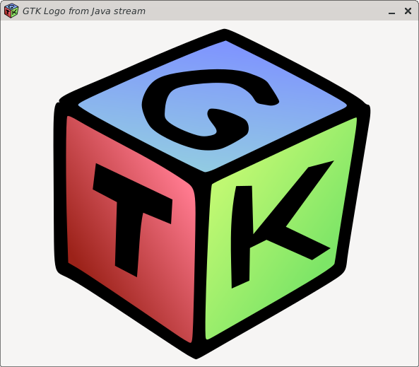

[](https://github.com/bailuk/java-gtk/actions/workflows/build-on-container.yml)

# Java-GTK
Experimental GTK 4 bindings for Java

[](examples/src/main/java/examples/ImageBridge.java)

## Example
```java
package examples;

import ch.bailu.gtk.gio.ApplicationFlags;
import ch.bailu.gtk.gtk.Application;
import ch.bailu.gtk.gtk.ApplicationWindow;
import ch.bailu.gtk.gtk.Button;
import ch.bailu.gtk.type.Str;
import ch.bailu.gtk.type.Strs;

public class HelloWorld {
    public static void main(String[] args) {
        GTK.init();
        new HelloWorld(args);
    }

    public HelloWorld(String[] args) {
        var app = new Application(new Str("com.example.GtkApplication"),
            ApplicationFlags.FLAGS_NONE);

        app.onActivate(() -> {
            
            // Create a new window
            var window = new ApplicationWindow(app);

            // Create a new button
            var button = Button.newWithLabelButton(new Str("Hello, World!"));

            // When the button is clicked, close the window
            button.onClicked(() -> window.close());
            window.setChild(button);
            window.show();
        });

        app.run(args.length, new Strs(args));
    }
}
```

## Build
`./gradlew generator:generate`  
Compiles and runs the code generator. This will generate Java and C code from [GIR](https://gi.readthedocs.io/en/latest/) files.
- Input: `generator/src/resources/gir/*`
- Output Java: `java-gtk/build/generated/src/main/java/[...]/*.java`
- Output C: `glue/build/generated/src/main/c/*.c`
- Configuration: [generator/src/main/kotlin/ch/bailu/gtk/Configuration.kt](generator/src/main/kotlin/ch/bailu/gtk/Configuration.kt)

`./gradelw java-gtk:classes`  
Compiles java classes and creates JNI headers

`make -C glue -j`  
Compile C code and generate C library
- Input: JNI headers and generated C code
- Output: `glue/build/lib/[...]/libglue.so`

`./gradlew java-gtk:build`  
Create library, create javadoc and run tests
- Output: jar, javadoc.jar and sources.jar in `libray/build/libs/` 

`./gradlew examples:run`  
Run the default demo application.
The default demo application can be selected in [examples/src/main/java/examples/App.java](examples/src/main/java/examples/App.java)

`./gradlew publishToMavenLocal`  
Compile Java and C library, generate JAR archive and copy JAR archive as artifact to local Maven repository (`~/.m2/repository`).

 
 ## Modules
 - `generator/`: Kotlin application that generates C and Java code from GIR files (xml parser -> model builder -> writer). GIR files are taken from Debian dev packages.
 - `java-gtk/` : java-gtk library depends on generated Java code.
 - `glue/`     : JNI C-Library. Depends on generated C code.
 - `examples/` : Some examples to test the bindings. Mostly ported from [https://gitlab.gnome.org/GNOME/gtk/-/tree/main/demos/gtk-demo](https://gitlab.gnome.org/GNOME/gtk/-/tree/main/demos/gtk-demo).
 
 ## License
 - Files in [generator/src/resources/gir/](generator/src/resources/gir/) are comming from the [GTK project](https://gitlab.gnome.org/GNOME/gtk) and are therefore licensed under the GNU Library General Public License.
 - Examples in [examples/src/main/java/examples/gtk3_demo](examples/src/main/java/examples/gtk3_demo) are ported from the [GTK project](https://gitlab.gnome.org/GNOME/gtk/-/tree/main/demos/gtk-demo) and are therefore licensed under the GNU Library General Public License.   
 - Everything else licensed under the [MIT License](https://en.wikipedia.org/wiki/MIT_License)
