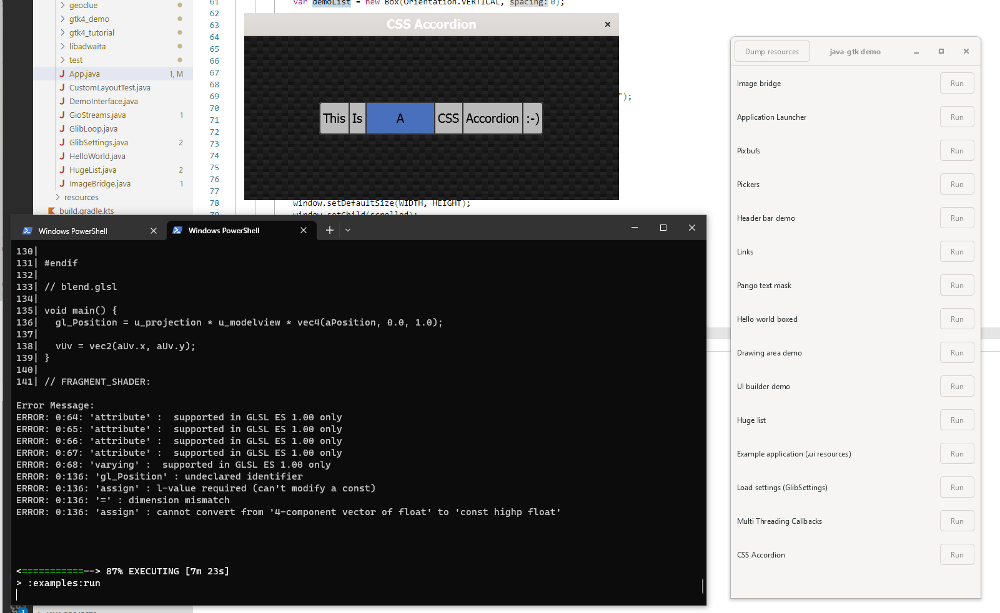

# Windows library load order

Windows library (dll) search paths: 
- Current directory
- Application directory (java.exe)
- Windows System directories
- Windows PATH variable


# Related and usefull system properties

```Java
System.setProperty("jna.debug_load", "true");
System.out.println(System.getProperty("java.library.path"));
System.out.println(System.getProperty("jna.library.path"));
```

# JNA library load order

1. `java.library.path`
2. `jna.library.path`
3. Resource path: JAR or `build\classes\java\main`

# Dependencies

DLLs depend on other DLLs. In this case linking is done by the Windows OS and not by JNA.
To check dependencies, run ldd from WinGW Terminal: `ldd library-to-check.dll`

DLLs loaded by JNA must be identical (same file, not a copy) with DLLs loaded by Windows.


# Naming

lib[name]-[major]-[minor].dll

GTK-4 library: libgtk-4-1.dll. Name used by java-gtk: "gtk-4" => JNA searches for: `gtk-4.dll`
Standard C Library as provided by Microsoft: msvcrt.dll


# Install GTK libraries

- See [Setting up GTK for Windows](https://www.gtk.org/docs/installations/windows)

1. Download and install [MSYS2](http://www.msys2.org/)
2. Install [MinGW-w64](https://www.mingw-w64.org/) Packages:
```PowerShell
pacman -S mingw-w64-x86_64-gtk4
pacman -S mingw-w64-x86_64-libadwaita
```
3. Add `C:\msys64\mingw64\bin` to PATH


# Build and run sample

```PowerShell
 .\gradlew.bat generate
 .\gradlew.bat build
 .\gradlew.bat run
```

# Screenshot


